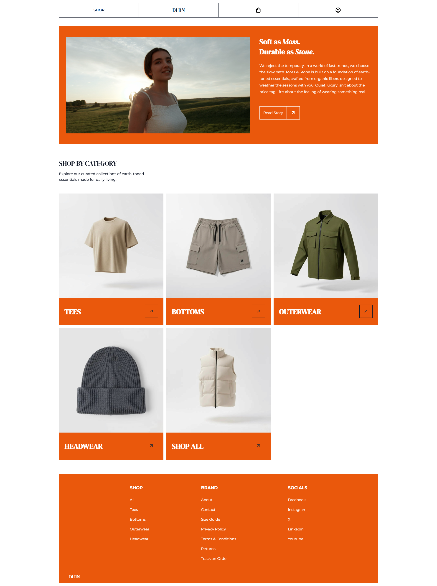
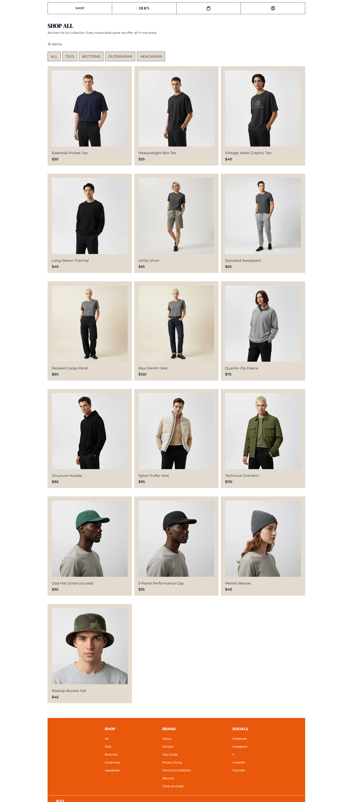
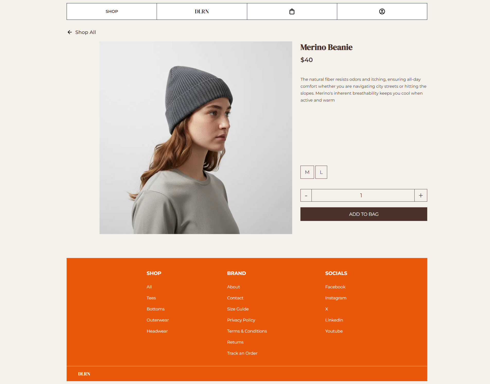
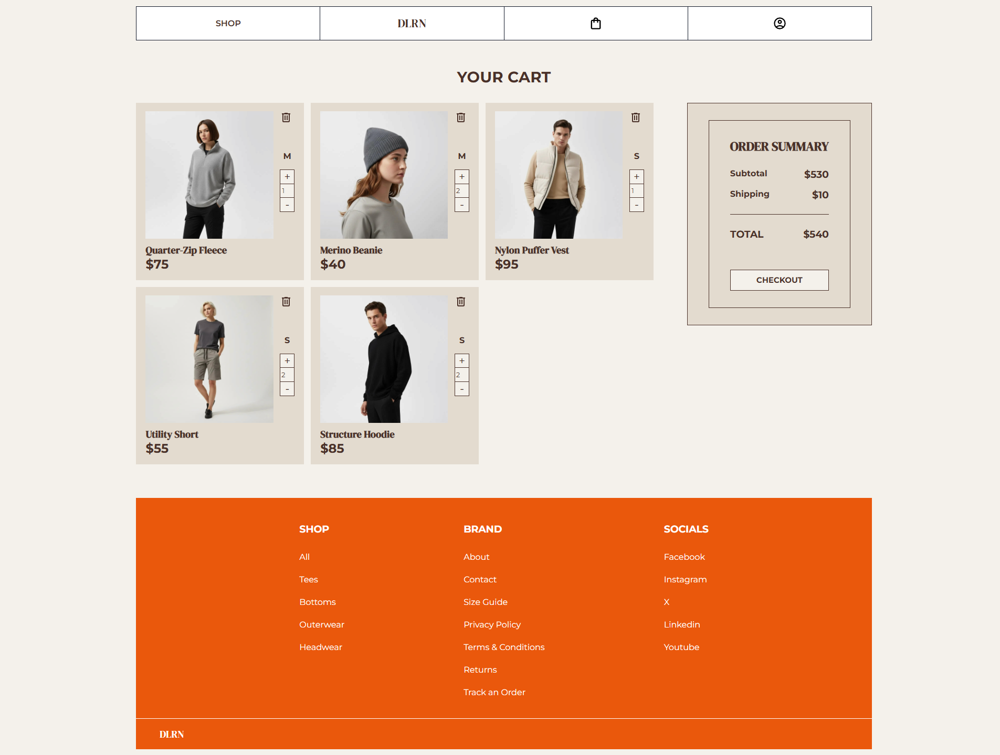
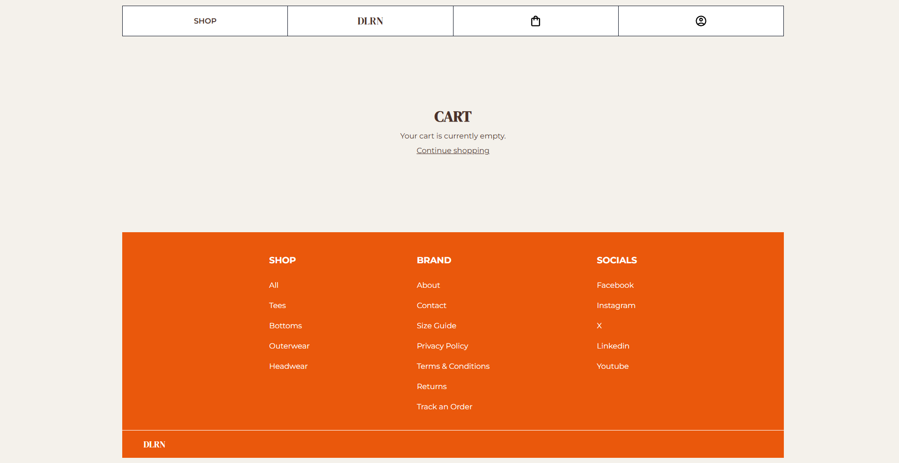
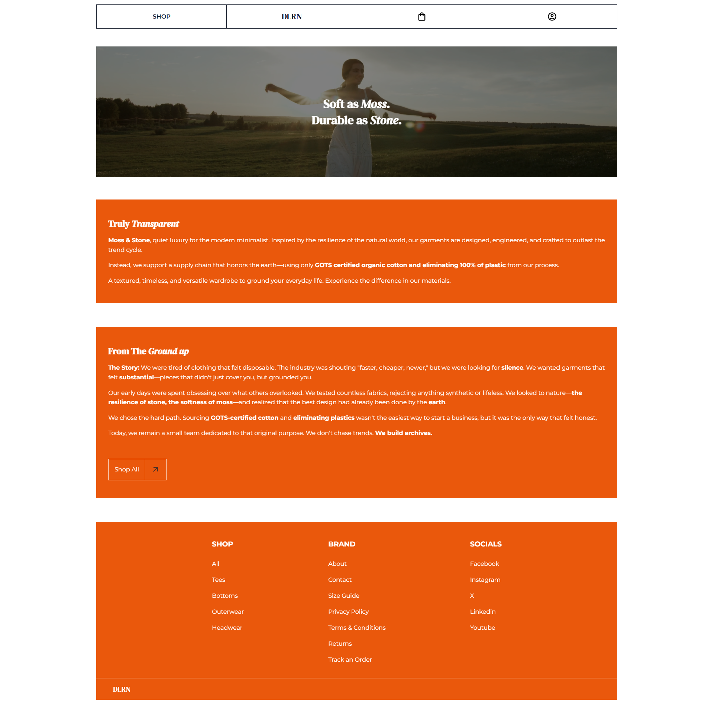

<h1 align="center">DLRN 👕</h1>

  A modern and responsive e-commerce clothing web application built with HTML, CSS, and Vanilla JavaScript, featuring a clean user experience and modular architecture.

  
  

  
  
  

---

## 📸 Preview

  
  

  
  

  
  

---

## ✨ Features

- Responsive, mobile-first design
- Browse clothing products
- View detailed product information
- Add and manage items in the shopping cart
- Persistent shopping cart using Local Storage
- Modular JavaScript architecture with ES Modules
- Clean and intuitive user interface

---

## 🛠️ Tech Stack

### Frontend

- HTML5
- CSS3
- JavaScript (ES6 Modules)

### Tools

- Visual Studio Code
- Git
- GitHub

### Deployment

- GitHub Pages

---

## 🚀 Future Enhancements

### Shopping Experience
- Product search
- Category filtering
- Wishlist
- Product reviews

### User Features
- User authentication
- Order history

### Checkout
- Checkout flow
- Payment integration

### Admin
- Admin dashboard

### Backend
- REST API with Node.js & Express
- PostgreSQL database integration

---

## 👨‍💻 Author

**Denver Delorino**

Aspiring Software Engineer

GitHub: [@devdelorino](https://github.com/devdelorino)